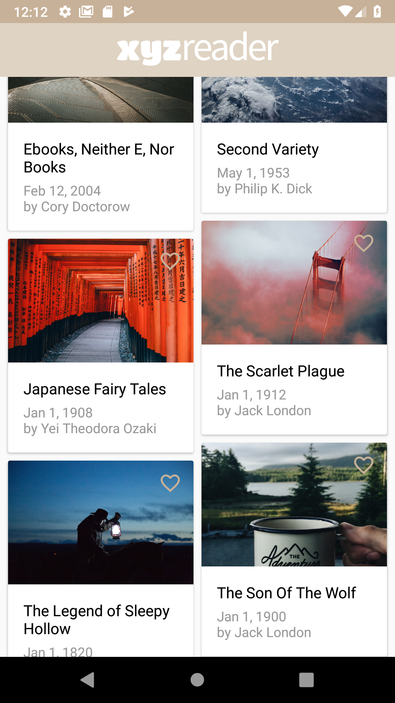
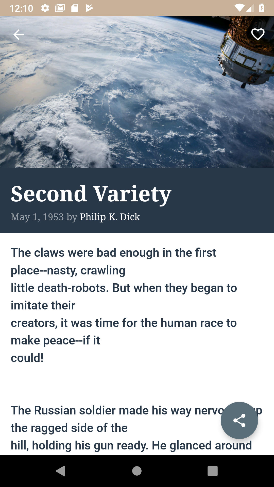

# XYZ Reader

The XYZ Reader is the fourth project in the Udacity's Android Dev Nanodegree.

## Project Overview

In this project, you will redesign an app to follow the Material Design guidelines and translate a set of static design mocks to a living and breathing app.

## Why this Project?

This project gives you an opportunity to improve an app’s design, a vital skill for building apps users will love. It also replicates a common developer task of updating and changing an app's design as new standards are released.

## What Will I Learn?

Through this project, you will:

    Understand the fundamentals of Android design.
    Apply Material Design guidelines to an mobile application.
    Separate an interface into surfaces.
    Effectively use transitions and motion.

The XYZ Reader project in Udacity's Android Nanodegree.

## Screenshots

**Atricle List Activity**  
 

**Article Details Activity**  
 

